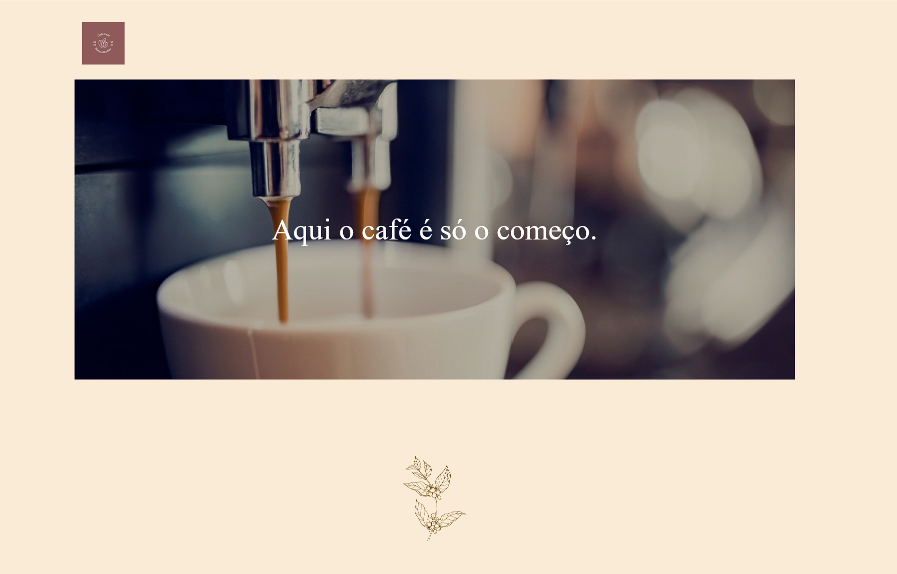

# Code Café

Landing page de uma cafeteria fictícia, em HTML e CSS.

Demo: https://theusan777.github.io/projeto.landing-page/

## Preview

<p align="center">
  
</p>

<p align="center">
  
</p>

## Sobre o projeto

Página de uma página só para a cafeteria fictícia "Code Café", com seções de apresentação (Quem Somos), localização (Onde Estamos) e contato, além de rodapé com redes sociais.

O texto da seção "Quem Somos" ainda está com Lorem ipsum, não foi preenchido com conteúdo real.

## Tecnologias

- HTML
- CSS

## Funcionalidades

- Navegação por âncora entre as seções (Quem Somos, Onde Estamos, Contato)
- Layout responsivo (CSS com breakpoints próprios em `responsive.css`)
- Seção de contato com endereço, telefone, e-mail e horário de atendimento

## Estrutura do projeto

```
index.html
src/
  css/
    reset.css
    style.css
    responsive.css
  images/
```

## Como executar

git clone https://github.com/theusan777/projeto.landing-page.git

Depois é só abrir o `index.html` no navegador.

## Deploy

[Acessar projeto](https://theusan777.github.io/projeto.landing-page/)

## Aprendizados

Projeto focado em responsividade, com um arquivo CSS separado só pros breakpoints, em vez de misturar tudo no mesmo arquivo.

## Próximos passos

- Substituir o texto Lorem ipsum da seção "Quem Somos" por conteúdo real
- Colocar links reais no Facebook e Instagram do rodapé (hoje apontam pra `#`)
